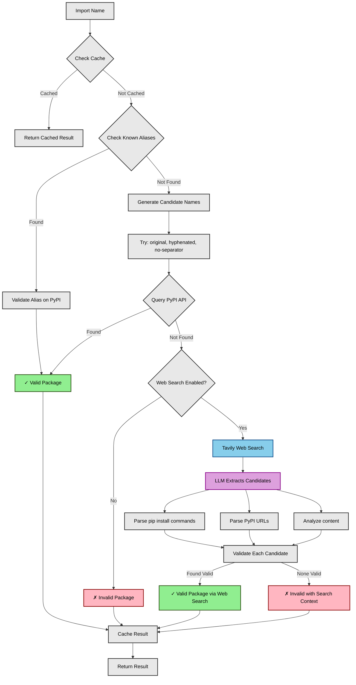
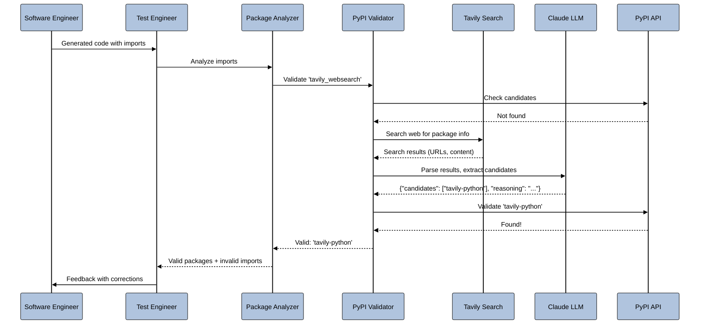

# PyPI Import Validation

This document describes the PyPI validation feature that helps detect hallucinated or invalid Python package imports generated by the software engineer agent.

## Overview

When the software engineer agent generates Python code, it may sometimes include imports for packages that don't actually exist on PyPI (hallucinated packages) or use incorrect import names. This validation system:

1. **Validates imports against PyPI** - Checks if each imported package actually exists on PyPI
2. **Resolves import names to distribution names** - Converts import names (e.g., `sklearn`) to the correct PyPI distribution names (e.g., `scikit-learn`)
3. **Web search fallback** - Uses Tavily web search to find correct package names when PyPI validation fails
4. **LLM-powered candidate extraction** - Intelligently parses web search results to identify valid package candidates
5. **Provides feedback to the software engineer** - Reports invalid imports back to the agent so it can fix them

## Architecture Diagram

<div style="background-color: white; padding: 20px; border-radius: 8px;">



</div>

## Components

### 1. `pypi_validator.py`

A standalone module that validates Python imports against PyPI using the PyPI JSON API and web search.

**Key features:**
- Checks if a distribution exists on PyPI
- Generates candidate distribution names from import names (handles underscores, hyphens, etc.)
- Resolves import names to correct distribution names
- Supports known aliases (e.g., `sklearn` → `scikit-learn`, `tavily` → `tavily-python`)
- **Web search integration** - Uses Tavily to search for package information when PyPI validation fails
- **LLM-powered extraction** - Uses Claude to intelligently parse search results
- Provides detailed package information from PyPI
- Caches results for performance

**Example usage:**

```python
from pypi_validator import PyPIValidator

# Basic validation
validator = PyPIValidator()
is_valid, dist_name, error_msg = validator.validate_import('sklearn', {'sklearn': 'scikit-learn'})

if is_valid:
    print(f"Package found: {dist_name}")
else:
    print(f"Invalid import: {error_msg}")

# With web search enabled
validator = PyPIValidator(
    enable_web_search=True,
    model="anthropic/claude-sonnet-4-5-20250929"
)
is_valid, dist_name, error_msg = validator.validate_import('tavily_websearch')
# Web search will find 'tavily-python' as the correct package!
```

### 2. `TavilySearchHelper` Class

Handles web search integration for package discovery.

**Key methods:**

- `_extract_package_candidates_with_llm()` - Uses LLM to parse search results and extract package names
- `_extract_package_candidates_regex()` - Fallback regex-based extraction
- `search_and_validate_package()` - Searches web and validates candidates against PyPI

**How it works:**

1. Searches Tavily with query: `"Python package PyPI import {import_name} pip install"`
2. Sends search results to LLM with structured prompt
3. LLM returns JSON: `{"candidates": ["pkg1", "pkg2"], "reasoning": "explanation"}`
4. Validates each candidate against PyPI
5. Returns first valid package found

### 3. Updates to `docker_test.py`

The `PythonPackageAnalyzer` class now:
- Uses `PyPIValidator` to validate all detected imports
- Supports web search via `enable_web_search` parameter
- Accepts `model` parameter for LLM-based search parsing
- Tracks invalid imports in `self.invalid_imports`
- Only includes validated packages in `requirements.txt`
- Provides a `get_invalid_imports()` method to retrieve validation errors

**Initialization:**
```python
analyzer = PythonPackageAnalyzer(
    src_dir="src",
    enable_web_search=True,  # Enable Tavily search
    model="anthropic/claude-sonnet-4-5-20250929"  # LLM for parsing
)
```

### 4. Updates to `agents_from_scratch_docker.py`

**New CLI flag:**
- `--search true|false` - Enable/disable Tavily web search (default: `true`)

**Environment variables:**
- `TAVILY_API_KEY` - Required when `--search true`
- Loaded from `.env` file automatically

**Startup validation:**
- Checks for `TAVILY_API_KEY` when web search is enabled
- Prompts user to continue without key or exit

The `TestEngineerAgent` now:
- Passes `enable_web_search` to `PythonPackageAnalyzer`
- Passes `model` parameter for LLM parsing
- Retrieves invalid imports from the analyzer
- Includes invalid imports in the test results dictionary
- Reports invalid imports in the compressed feedback to the software engineer
- Provides actionable suggestions for fixing invalid imports

## How It Works

### Validation Algorithm

When validating an import like `tavily_websearch`:

1. **Check cache** - See if we've already validated this import
2. **Check known aliases** - Look up in the alias dictionary (e.g., `tavily` → `tavily-python`)
3. **Generate candidates** - Create variations:
   - `tavily_websearch` (original)
   - `tavily-websearch` (underscores to hyphens)
   - `tavilywebsearch` (no separators)
4. **Query PyPI** - For each candidate, call `https://pypi.org/pypi/{candidate}/json`
5. **Web Search (if enabled and PyPI fails)**:
   - Search Tavily for package information
   - LLM analyzes results and extracts candidate package names
   - Validate each candidate against PyPI
   - Return first valid package found
6. **Return result**:
   - If found via PyPI or web search: `(True, distribution_name, None)`
   - If not found: `(False, None, error_message_with_search_results)`

### Web Search Enhanced Flow

<div style="background-color: white; padding: 20px; border-radius: 8px;">



</div>

### Integration Flow

```
Software Engineer generates code
         ↓
TestEngineer extracts imports
         ↓
PythonPackageAnalyzer.analyze()
         ↓
PyPIValidator validates each import
         ↓
    [PyPI Check]
         ↓
    Found? → Valid imports → requirements.txt
         ↓
    Not Found & Web Search Enabled?
         ↓
    [Tavily Web Search]
         ↓
    [LLM Candidate Extraction]
         ↓
    [Validate Candidates on PyPI]
         ↓
    Found? → Valid imports → requirements.txt
         ↓
    Still Not Found → invalid_imports list
         ↓
Test results include invalid_imports
         ↓
Compressed feedback sent to Software Engineer
         ↓
Software Engineer fixes invalid imports
```

## Testing

Run the test script to see the validator in action:

```bash
python test_pypi_validator.py
```

This will demonstrate:
- Validating individual imports
- Resolving aliases (sklearn → scikit-learn, tavily → tavily-python)
- Detecting hallucinated packages
- **Web search finding correct packages** (tavily_websearch → tavily-python)
- **LLM reasoning for candidate selection**
- Batch validation
- Error reporting

**Example output:**
```
tavily_websearch               (Possibly hallucinated package)
Searching web for information about 'tavily_websearch'...
   LLM reasoning: Both packages are directly related to Tavily search functionality...
✓ Web search found valid package: tavily-python
  ✓ VALID: tavily-python
  Summary: Python wrapper for the Tavily API
```

## Common Aliases

The system includes these built-in aliases:

| Import Name | Distribution Name |
|-------------|------------------|
| `sklearn` | `scikit-learn` |
| `dotenv` | `python-dotenv` |
| `tavily` | `tavily-python` |
| `bs4` | `beautifulsoup4` |

You can add more aliases by modifying the `package_aliases` dictionary in `PythonPackageAnalyzer.__init__()`.

## Configuration

### Environment Variables

```bash
# Required for web search
export TAVILY_API_KEY="tvly-your-api-key-here"

# Or use .env file
echo "TAVILY_API_KEY=tvly-your-api-key-here" > .env
```

### CLI Arguments

```bash
# Enable web search (default)
python agents_from_scratch_docker.py --search true

# Disable web search
python agents_from_scratch_docker.py --search false

# Specify model for LLM parsing
python agents_from_scratch_docker.py --model anthropic/claude-sonnet-4-5-20250929
```

### Code Configuration

```python
# PyPI Validator
validator = PyPIValidator(
    enable_web_search=True,  # Enable Tavily search
    model="anthropic/claude-sonnet-4-5-20250929"  # LLM model
)

# Package Analyzer
analyzer = PythonPackageAnalyzer(
    src_dir="src",
    enable_web_search=True,
    model="anthropic/claude-sonnet-4-5-20250929"
)
```

**Configurable parameters:**

1. **Timeout**: Change `self.timeout` in `PyPIValidator.__init__()` (default: 5 seconds)
2. **Aliases**: Add to `self.package_aliases` in `PythonPackageAnalyzer.__init__()`
3. **Cache size**: Modify `@lru_cache(maxsize=256)` decorator
4. **Candidate generation**: Customize `generate_candidate_names()` method
5. **Web search model**: Change `model` parameter (default: Claude Sonnet 4.5)
6. **Search depth**: Modify `search_depth` in `search_and_validate_package()` (basic/advanced)

## Error Handling

The validator gracefully handles:
- Network timeouts (5-second timeout per request)
- HTTP errors (treats as package not found)
- PyPI API unavailability (treats as unknown, allows to proceed)
- Rate limiting (uses caching to minimize requests)
- **Missing TAVILY_API_KEY** (prompts user or falls back to PyPI-only validation)
- **Tavily API failures** (falls back to regex-based extraction)
- **LLM parsing errors** (falls back to regex-based extraction)
- **Invalid JSON from LLM** (gracefully handles and retries with fallback)

## Performance

- **Caching**: Results are cached using `@lru_cache(maxsize=256)` and instance-level caching
- **Timeouts**: 5-second timeout per PyPI request, 10-second timeout for web searches
- **LLM calls**: Only invoked when PyPI validation fails and web search is enabled
- **Smart fallbacks**: Regex extraction if LLM fails, PyPI-only if web search unavailable
- **Candidate validation**: Stops at first valid package found

## Web Search Intelligence Examples

### Example 1: Typo Detection
```
Input: tavily_websearch
→ PyPI check fails
→ Web search finds: "pip install tavily-python"
→ LLM extracts: "tavily-python"
→ Validates on PyPI: ✓
Result: tavily-python
```

### Example 2: Hallucinated Package
```
Input: this_is_definitely_fake_12345
→ PyPI check fails
→ Web search finds: Generic Python packaging info
→ LLM analysis: "No packages related to this import"
→ Result: Invalid with helpful context
```

### Example 3: Alternative Names
```
Input: tavily-websear5ch (typo)
→ PyPI check fails
→ Web search finds: tavily-python documentation
→ LLM reasoning: "Appears to be a typo of 'tavily'"
→ Validates: tavily-python ✓
Result: tavily-python
```

## Future Enhancements

Potential improvements:
1. **Parallel validation** - Validate multiple packages concurrently
2. **Local database** - Maintain a local cache of import → distribution mappings
3. **Fuzzy matching** - Suggest similar package names for typos (beyond web search)
4. **Version checking** - Validate specific version requirements
5. **Dependency analysis** - Check if dependencies are also valid
6. **Custom PyPI mirrors** - Support private PyPI repositories
7. **Search result caching** - Cache web search results to reduce API calls
8. **Multi-LLM support** - Allow different models for different use cases

## Troubleshooting

**Validator reports false negatives (valid packages marked invalid):**
- Add the import → distribution mapping to `package_aliases`
- Enable web search with `--search true`
- Check if the package name uses non-standard separators

**Web search not finding packages:**
- Verify `TAVILY_API_KEY` is set correctly
- Check network connectivity to Tavily API
- Try running test script to verify search is working

**LLM extraction failing:**
- Check litellm configuration and API keys
- Verify model name is correct
- System will fall back to regex extraction automatically

**Validator is too slow:**
- Results are cached, so subsequent runs should be faster
- Disable web search with `--search false` if not needed
- Consider increasing cache size or implementing persistent caching

**PyPI requests timing out:**
- Check network connectivity
- Increase timeout in `PyPIValidator.__init__()`
- The system will continue with unvalidated packages if PyPI is unavailable

**TAVILY_API_KEY warnings:**
- Set the key in `.env` file or environment
- Or disable web search with `--search false`
- System will prompt before continuing without the key

## Dependencies

**Required:**
- `requests` - PyPI API calls
- `litellm` - LLM integration

**Optional (for web search):**
- `tavily-python` - Tavily web search API
- `python-dotenv` - Environment variable management

Install all dependencies:
```bash
pip install -r requirements.txt
```
