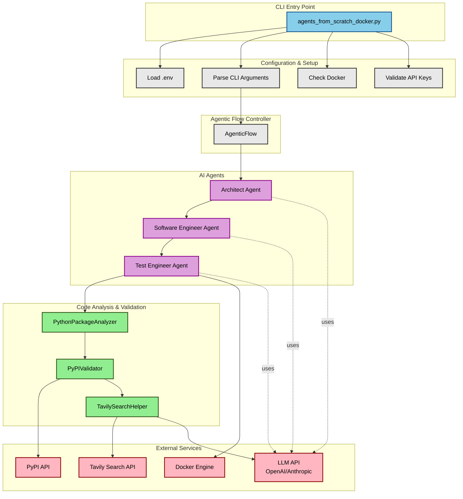
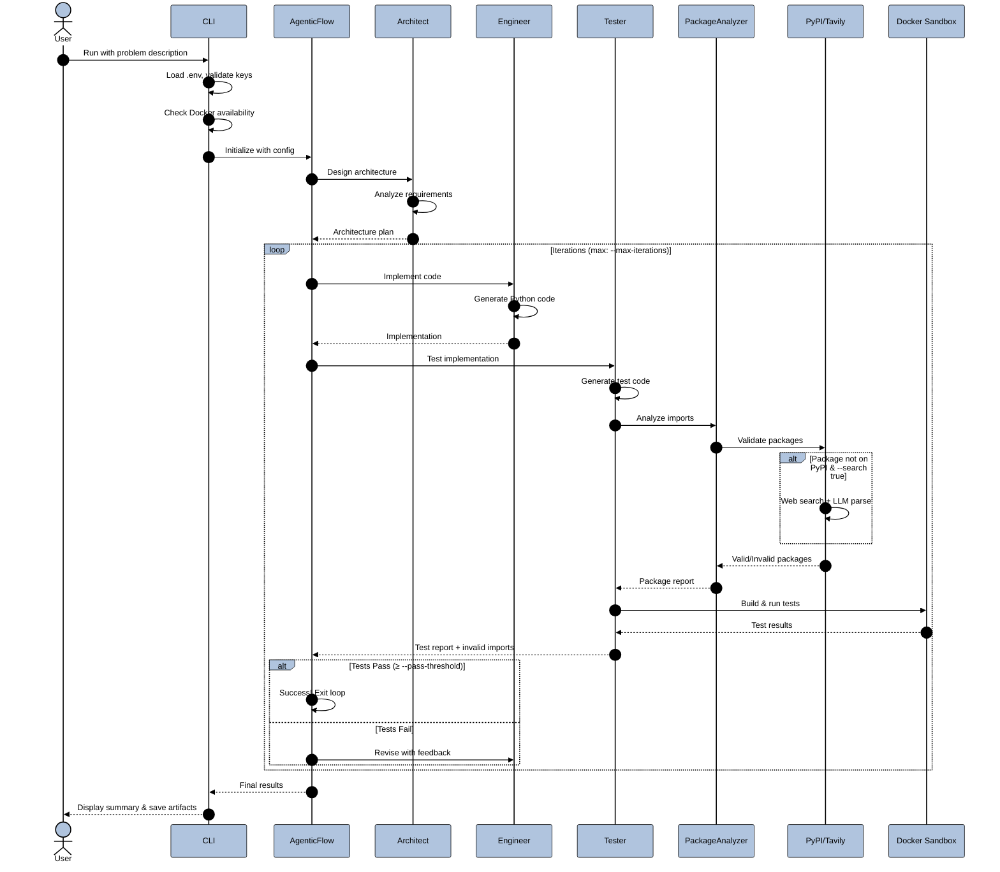

# Agents from scratch

This is an experiment using Claude Code to design and create an "agentic framework" using only barebones dependencies and raw openai (or openai-compatible) API calls.

[](https://deepwiki.com/oshea00/codeagents)

# Example of creating a calculator

The description given to the program for the calculator program:
'Create a cli scientific calculator using sympy that runs in a REPL loop and also accepts an expression from the command line'

The resulting code is in the ```calculator_dir```

## Build and run example
```bash
cd calculator_dir
docker build -t calc .
docker run -it calc python main.py
```

# Example of creating a weather API

The description given to the program for the api program is in ```problem.txt```
The resulting code is in the ```weather_api```

## Build and run Example
```bash
cd weather_api
docker build -t weather .
docker run -it -p8000:8000 weather uvicorn main:app --host 0.0.0.0 --port 8000
```
Open browser at http://localhost:8000/docs

# Instructions for use

## Prerequisites

### Required
- **Docker** - For running code in sandboxed containers
- **OPENAI_API_KEY** or **ANTHROPIC_API_KEY** - Depending on your chosen LLM provider
- **Python 3.12+** environment with dependencies
- **uv** utility for environment management

### Optional (for enhanced package validation)
- **TAVILY_API_KEY** - For web search-based package discovery (when `--search true`)
  - Get your API key from [Tavily](https://tavily.com)
  - Set in `.env` file or environment: `TAVILY_API_KEY=tvly-your-key`

## Running the script

From the root of the project directory:
```bash
uv sync
source .venv/bin/activate
python agents_from_scratch_docker.py [OPTIONS]
```

## Command Line Options

### Core Options
- `--description-file <path>` - Path to a file containing the problem description
- `--model <model>` - Model name to use (e.g., `openai/gpt-5-mini`, `anthropic/claude-sonnet-4-5-20250929`). If not provided, you'll be prompted to choose a provider.
- `--max-tokens <n>` - Maximum tokens to generate (default: 64000)

### Testing & Validation Options
- `--max-iterations <n>` - Maximum number of test-fix iterations (default: 2)
- `--pass-threshold <percent>` - Minimum percentage of tests that must pass to succeed (default: 90.0)
- `--search <true|false>` - Enable Tavily web search for package validation (default: true)
  - When enabled, searches the web to find correct package names for imports not found on PyPI
  - Uses LLM to intelligently parse search results
  - Requires `TAVILY_API_KEY` environment variable

## Examples

### Interactive mode with default settings:
```bash
python agents_from_scratch_docker.py
```
This will:
- Check Docker availability
- Load `.env` file if present
- Check for `TAVILY_API_KEY` (since `--search true` is default)
- Prompt for LLM provider selection
- Ask for problem description

### Specify model directly:
```bash
python agents_from_scratch_docker.py --model openai/gpt-5-mini
```

### Use a problem description file with custom settings:
```bash
python agents_from_scratch_docker.py \
  --description-file problem.txt \
  --model anthropic/claude-sonnet-4-5-20250929 \
  --max-iterations 3 \
  --pass-threshold 95.0 \
  --max-tokens 32000
```

### Disable web search for package validation:
```bash
python agents_from_scratch_docker.py --search false
```
This runs without Tavily integration (no `TAVILY_API_KEY` required)

### Full example with all options:
```bash
python agents_from_scratch_docker.py \
  --description-file my_project.txt \
  --model anthropic/claude-sonnet-4-5-20250929 \
  --max-iterations 2 \
  --pass-threshold 90.0 \
  --max-tokens 64000 \
  --search true
```

## Supported Models

The system uses `litellm` to support multiple LLM providers:

### OpenAI models:
- `openai/gpt-4.1` - Supports `temperature` and `max_tokens`
- `openai/gpt-4o` - Supports `temperature` and `max_tokens`
- `openai/gpt-5-mini` - Uses `max_completion_tokens`, no `temperature` support

### Anthropic models:
- `anthropic/claude-sonnet-4-5-20250929` - Supports `temperature` and `max_tokens` (recommended)

The system automatically handles parameter differences between models.

## System Architecture

### High-Level Component Diagram

<div style="background-color: white; padding: 20px; border-radius: 8px;">



</div>

### Activity Flow Diagram

<div style="background-color: white; padding: 20px; border-radius: 8px;">



</div>

### Component Descriptions

**CLI Layer:**
- `agents_from_scratch_docker.py` - Main entry point, handles argument parsing and orchestration
- Configuration validation (API keys, Docker availability)
- Environment setup (`.env` loading)

**Agent Layer:**
- **Architect Agent** - Analyzes problem descriptions and designs software architecture
- **Software Engineer Agent** - Implements Python code based on architecture plans
- **Test Engineer Agent** - Generates tests, runs Docker sandbox, provides feedback

**Analysis & Validation Layer:**
- **PythonPackageAnalyzer** - Extracts imports from code and validates them
- **PyPIValidator** - Three-tier validation: PyPI lookup → web search → LLM parsing
- **TavilySearchHelper** - Web search integration for package discovery

**External Services:**
- **LLM APIs** - OpenAI or Anthropic for agent intelligence
- **PyPI API** - Package existence validation
- **Tavily Search API** - Web search for package discovery (optional)
- **Docker Engine** - Isolated code execution and testing

## Features

### Intelligent PyPI Package Validation

The system includes sophisticated package validation to detect and fix hallucinated or incorrect package imports:

**Three-tier validation approach:**

1. **PyPI Direct Lookup** - Validates imports against PyPI with intelligent name variations
   - Handles common naming patterns: `tavily_websearch` → tries `tavily-websearch`, `tavilywebsearch`
   - Known aliases: `sklearn` → `scikit-learn`, `dotenv` → `python-dotenv`, `tavily` → `tavily-python`

2. **Web Search Discovery** (when `--search true`)
   - Uses Tavily to search for package information when PyPI lookup fails
   - Example: `tavily_websearch` → searches web → finds `tavily-python`

3. **LLM-Powered Extraction**
   - Intelligently parses search results to extract valid package names
   - Validates discovered packages against PyPI before accepting
   - Provides reasoning for candidate selection

**Results:**
- ✅ Prevents Docker build failures from hallucinated packages
- ✅ Automatically discovers correct package names for typos/variants
- ✅ Provides detailed feedback to the agent for fixing invalid imports
- ✅ Only includes validated packages in `requirements.txt`

**Example:**
```
Input: import tavily_websearch
→ PyPI check fails (tavily_websearch, tavily-websearch not found)
→ Web search: "Python package PyPI import tavily_websearch pip install"
→ LLM extracts: ["tavily-python", "langchain-tavily"]
→ Validates tavily-python on PyPI: ✓ Found
→ Result: Uses tavily-python in requirements.txt
```

**See [PYPI_VALIDATION.md](PYPI_VALIDATION.md) for complete documentation** including:
- Architecture diagrams
- Configuration options
- Testing examples
- Troubleshooting guide

### Agentic Workflow

The system uses three specialized agents:

1. **Architect Agent** - Designs the software architecture from problem descriptions
2. **Software Engineer Agent** - Implements Python code based on the architecture
3. **Test Engineer Agent** - Tests code in Docker sandbox, validates packages, provides feedback

**Iterative improvement:**
- Agents work together in a feedback loop
- Test failures trigger code revisions
- Continues until tests pass or max iterations reached
- Invalid imports are detected and reported for fixing

### Docker Sandbox Testing

All generated code is:
- Tested in isolated Docker containers
- Validated for compilation and correctness
- Checked for package availability
- Scored based on test pass percentage (configurable threshold)

